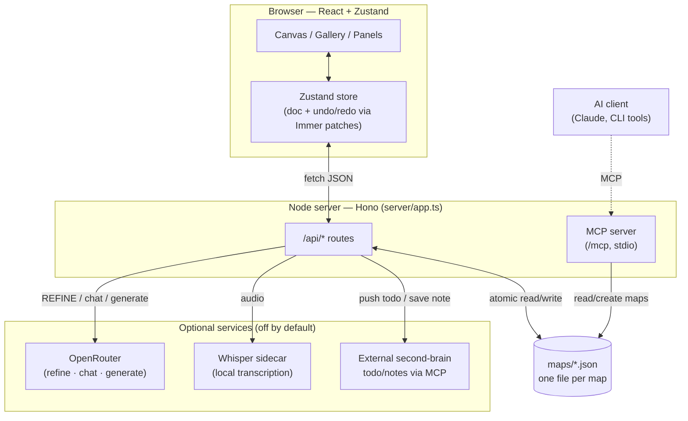

# Architecture

A tour of how mind-map is put together, for anyone reading or modifying the code.
For build/run conventions and how to add a feature, see [CONTRIBUTING.md](CONTRIBUTING.md).

## The big picture

mind-map is a single-page React app backed by a small [Hono](https://hono.dev) HTTP
server. Maps are plain JSON files on disk — there is no database. Everything else
(voice transcription, AI features, the external second-brain integration) is optional and
reached over HTTP.



The server is **framework-only** (`server/app.ts` never calls `serve()`). It is mounted
two ways from the same code:

- **Dev:** as Vite middleware ([`server/vite-plugin.ts`](server/vite-plugin.ts)), so the
  UI and API share one port (5454) with hot-module reload.
- **Production / Docker:** wrapped by [`server/standalone.ts`](server/standalone.ts),
  which serves the built assets and calls `serve()`.

This split keeps the request handlers identical in both environments.

## Frontend

- **Stack:** Vite + React 19 + TypeScript, [Zustand](https://github.com/pmndrs/zustand)
  for state.
- **The document (`doc`)** is the in-memory representation of the open map. Its persisted
  shape is `MapFile` (see [Data model](#data-model)); at runtime it also carries selection,
  collapse state, etc.
- **Undo/redo** is built on Immer's `produceWithPatches`. Every mutation runs through
  `store.runCommand`, which records the forward patches and their inverses, so undo and
  redo are exact and selection is restored from history. **Nothing mutates `doc` outside
  this path** — that invariant is what makes history correct.
- **Layout is a pure function.** [`src/layout/layout.ts`](src/layout/layout.ts) maps
  `(doc, sizes) → rectangles`. Node sizes come from
  [`src/layout/measure.ts`](src/layout/measure.ts), which measures text in an offscreen div
  using the same `.node-text` CSS as the real nodes — so measured and rendered sizes always
  agree. Four structures are supported: `right` (logic chart, default), `balanced` (both
  sides of the root), `down` (org chart), and `timeline` (roadmap). The result includes a
  `dirs` map saying which way each branch grows; rendering, `hjkl` navigation, and drag-drop
  all key off it.

## Backend

A handful of focused modules under [`server/`](server):

| File | Responsibility |
| --- | --- |
| `app.ts` | The Hono app and all `/api/*` routes. Framework-only — mounted by the others. |
| `vite-plugin.ts` | Mounts `app` as Vite middleware in dev. |
| `standalone.ts` | Production entry: serves built assets + `serve()`. Used by Docker. |
| `storage.ts` | Maps CRUD with atomic writes (write temp file, rename). |
| `openrouter.ts` | Calls to OpenRouter for refine, ask-this-map chat (streaming), and map generation. |
| `transcriber.ts` | Proxies audio to the Whisper sidecar. |
| `mcp.ts` | **Outbound** MCP client to the external second-brain (push todo / save note). |
| `mcp-server.ts` | **Inbound** MCP server exposing mind-map tools to AI clients (see [MCP.md](MCP.md)). |
| `mcp-stdio.ts` | stdio entry point for the inbound MCP server. |

The server imports shared types from `src/model/` only; it has no other dependency on the
frontend.

## Data model

Maps are pretty-printed JSON, one file per map, named `maps/<id>.json`. This is the whole
persistence layer — friendly to git, backups, and hand-editing.

```ts
interface MapFile {
  schemaVersion: 1;
  id: string;            // map id, also the file name
  title: string;
  createdAt: string;     // ISO 8601
  updatedAt: string;     // ISO 8601
  layout?: 'right' | 'balanced' | 'down' | 'timeline';
  pinned?: boolean;
  relationships?: Relationship[];
  root: FileNode;
}

interface FileNode {
  id: string;
  text: string;          // node label; supports inline markdown
  collapsed?: boolean;
  todoId?: string;       // set once pushed to the external todo service
  children: FileNode[];
}

interface Relationship {
  id: string;
  from: string;          // source node id
  to: string;            // target node id
  label?: string;
}
```

- The **root** node holds the map title.
- **Relationships** are free, directional arrows between *any* two nodes — not parent/child
  links. They live in the JSON but are deliberately excluded from markdown copy/paste, which
  stays tree-only.
- Schema migrations live in [`src/model/migrate.ts`](src/model/migrate.ts); bump
  `schemaVersion` and add a migration when the shape changes.

## Directory map

```
src/
  api/        client-side wrappers around the /api/* routes
  audio/      mic recording + the record → transcribe → insert flow
  canvas/     rendering: nodes, edges, relationship arrows, the node editor,
              drag-and-drop, viewport/pan-zoom, layout cache
  components/  panels and overlays: chat, transcript, help, status bar, toasts
  gallery/    the Esc map menu: sections, fuzzy search, recents
  hotkeys/    keymap data + dispatcher that resolves key combos to command ids
  layout/     pure layout function + text measurement
  model/      types, doc helpers, markdown (block + inline), segments, migrations
  state/      Zustand store, Immer command functions, command registry, autosave
server/       Hono app and the modules described above
transcriber/  Whisper sidecar (Python; faster-whisper) used for local transcription
maps/         your map JSON files (git-ignored except the demo welcome map)
scripts/      make-shareable.sh — package a maps/secrets-free zip to hand to someone
```

## How a keystroke becomes a change

The command pattern ties the layers together:

1. A key combo is matched by the **dispatcher** ([`src/hotkeys/dispatcher.ts`](src/hotkeys/dispatcher.ts))
   against the **keymap** ([`src/hotkeys/keymap.ts`](src/hotkeys/keymap.ts)), resolving to a
   **command id**.
2. The id is looked up in the **registry** ([`src/state/registry.ts`](src/state/registry.ts)),
   which runs the command — typically `store.runCommand(name, draft => ...)`.
3. The draft function (pure, from [`src/state/commands.ts`](src/state/commands.ts)) mutates an
   Immer draft of `doc`; `produceWithPatches` captures patches for undo/redo.
4. The store notifies React; layout recomputes; autosave
   ([`src/state/autosave.ts`](src/state/autosave.ts)) persists the map to disk.

Adding a feature usually means: a command in the registry + a keymap binding (+ a draft
function if it mutates the doc). See [CONTRIBUTING.md](CONTRIBUTING.md#adding-a-feature).
